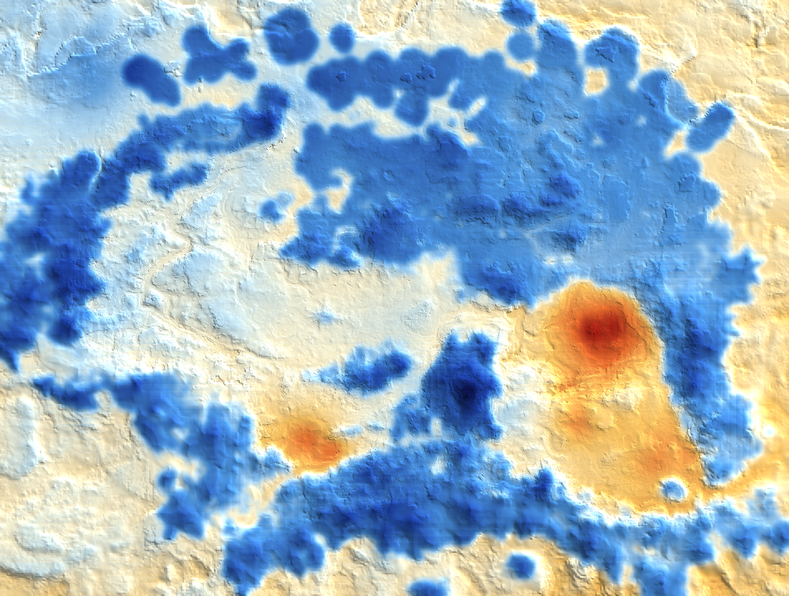

# RFAB Survival Layer

Самостоятельная реализация режима выживания специально для RFAB.

Разработано и тестировалось для **RFAB SE XI - Kazan edition [ver. 15.09.2026]**.

---

## Содержание

- [Потребности и штрафы](#потребности-и-штрафы)
- [Две доли шкалы](#две-доли-шкалы)
- [Тепло и мороз](#тепло-и-мороз)
- [Болезни](#болезни)
- [Походный быт](#походный-быт)
- [Виджет](#виджет)
- [Как мод встроен в сборку RFAB](#как-мод-встроен-в-сборку-rfab)
- [Установка](#установка)
- [Настройки](#настройки)
- [Если что-то пошло не так](#если-что-то-пошло-не-так)
- [Для разработчика](#для-разработчика)
- [Лицензия](#лицензия)

---

## Потребности и штрафы

Три потребности — **Сон**, **Сытость** и **Тепло**. У каждой своя шкала.

Пока шкала полна, потребность даёт прибавку к восстановлению: **«Выспался»**,
**«Сыт»**, **«Согрет»**. Когда шкала истощается, включается штраф — **Сонливость**,
**Голод** или **Холод**. Штраф сильнее всего режет профильную характеристику, но
задевает и две остальные, и скорость передвижения:

| потребность | штраф | профильная | перекрёстные |
|---|---|---|---|
| **Сон** | Сонливость | максимум магии | здоровье, запас сил |
| **Сытость** | Голод | максимум запаса сил | здоровье, магия |
| **Тепло** | Холод | максимум здоровья | магия, запас сил |

Штрафы к скорости передвижения складываются от всех трёх потребностей, и их
сумма ограничена отдельным потолком.

Нежить (Undead) Сна и Сытости не знает — этим занимается сам RFAB. У неё остаётся только
Тепло.

---

## Две доли шкалы

Каждая шкала состоит из двух долей, и наполняются они разным:

| потребность | основная доля | быстрая доля |
|---|---|---|
| **Сон** | сон в кровати; с перком «Бодрость» — любой сон | спальный мешок и прочие лежанки |
| **Сытость** | «Особая еда» RFAB | вся остальная еда |
| **Тепло** | только фактический отогрев | расходники с сопротивлением холоду: зелья и еда |

Тратится сначала **быстрая** доля, и тратится она **быстрее** основной.
Пока быстрая доля не опустела, основная не расходуется вовсе.
В бою **Сон** и **Сытость** уходят быстрее, а **Тепло** — медленнее.

На виджете быстрые доли выделены штриховкой.
В меню инвентаря также есть виджет с предпросмотром нового состояния шкалы
в случае использования расходника (еда, зелье). 

---

## Тепло и мороз

Температура вокруг складывается из **места**, погоды, времени суток и высоты
над землёй. Персонаж остывает или отогревается до окружающей температуры.

Место берётся из климатической карты: она запечена по рельефу Скайрима и
Солстейма и по снегу, который на этом рельефе нарисован, с шагом в одну вершину
ландшафта. Ниже она сама — синее холоднее, оранжевое теплее:

**Что греет:**

- **одежда** — по числу занятых слотов, а не по конкретной броне;
- **сопротивление холоду** — наравне с одеждой;
- **огонь** — костёр, очаг, факел;
- **помещение** — у интерьеров своя температура, у ледяных пещер - своя.

**Попадания стихией** двигают шкалу Тепла на долю того урона, который до вас
действительно дошёл: мороз отнимает, огонь добавляет. Поглощённое оберегом не
двигает шкалу вовсе.

Если шкала Тепла опустеет — начинается **гипотермия**: Лёгкая, Умеренная,
Тяжёлая. Зельями она не снимается, только теплом. Отдыхать с ней нельзя уже с
первой стадии — кроме как в помещении, где вы действительно отогреваетесь.

**Тяжёлая стадия смертельна.** Персонаж падает парализованным и теряет
возможность двигаться, замерзая до смерти.

Пока горит штраф **Холод** — а он загорается, когда истрачена четверть шкалы, —
не работают **«Телепортация»** и **«Метка и возврат»**, ни заклинания, ни
свитки. Любая стадия гипотермии блокирует их тем же образом.

---

## Болезни

Болезнь идёт по трём стадиям и может как ухудшаться, так и отступать — за этим
стоит скрытый счётчик, который двигают сон, еда, тепло и сопротивление болезням.
Пока вы больны, персонаж время от времени кашляет, а в активных эффектах видно
саму болезнь с её описанием.

### Шесть болезней выживания

Своих из них две — **Простуда** и **Тканевый стресс**. Остальные четыре
адаптированы из ванильного режима выживания.

| болезнь | откуда берётся |
|---|---|
| **Простуда** | переохлаждение; шанс растёт по мере того, как стынете |
| **Бурая гниль** | удар драугра |
| **Кишечные черви** | удар тролля |
| **Зелёные споры** | удар рыбы-убийцы |
| **Пищевое отравление** | сырая еда, если желудок не крепкий |
| **Тканевый стресс** | урон стихией и глубокий холод |

### Семь болезней RFAB

**Атаксия**, **Каменная подагра**, **Разжижение мозга**, **Хрипунец**,
**Костоломная лихорадка**, **Заумь** и **Изнеможение** получают вторую и третью
стадии. Первая остаётся записью RFAB и её эффектами, слово в слово.

### Как лечиться

| случай | чем |
|---|---|
| ранняя стадия | обычное лекарство или алтарь — снимает полностью |
| запущенная стадия | лекарство уже не вылечит, но заметно облегчит; дальше только уход за собой |
| **Тканевый стресс** | тот же уход; чистая льняная ткань — дополнительный способ ускорить |
| **гипотермия** | только тепло |

Выздоровление идёт, только пока **все три шкалы выше безопасной отметки**
(две трети у Сна, три четверти у Сытости и Тепла), и считаются при этом
**только основные доли**. Ниже половины хотя бы по одной — болезнь, наоборот,
развивается.

Под **благословением Периайта** шесть из семи болезней RFAB застывают на первой
стадии: они не развиваются дальше и не лечатся счётчиком. Это сделано намеренно,
чтобы не спорить с балансом сборки — благословение остаётся выгодным ровно так,
как задумано в RFAB.

---

## Походный быт

| что | условия |
|---|---|
| **«Развести костёр»** | способность от «Основ выживания». Нужны поленья. Горит несколько часов. Под дождём без крыши не разжечь |
| **Спальный мешок** | шьётся на дубильном станке; чтобы разместить, нужно выложить его на землю |
| **Палатка** | появляется у спальника, когда есть и «Основы выживания», и «Акклиматизация» |
| **Котелок** у костра | «Кулинар» и казан в инвентаре |
| **Заготовка дров** | перк «Основы выживания» обязателен, и к нему — колун либо рюкзак авантюриста. |

Кипятить воду можно у котелка: нужны «Основы выживания» и казан, на выходе —
бутылка с водой (используется в RFAB для крафта чистых льняных тканей и многих
**Особых** блюд).

---

## Виджет

Три шкалы потребностей и иконка температуры. Положение, размер, прозрачность и
геометрия настраиваются в MCM.

**Иконка температуры** стоит под компасом и показывает ощущение тепла и
холода — обстановку вокруг, а не саму шкалу. Поэтому она предупреждает заранее:
здесь вы будете замерзать или отогреваться.

Короткая справка по механикам есть и в самой игре: **игровое меню → Помощь →
«[RFAB] Режим выживания»**.

---

## Как мод встроен в сборку RFAB

Мод сильно интегрирован в инфраструктуру и баланс RFAB.

### Тепло считается не по броне

Собственного «рейтинга тепла» для брони нет. Утепление считается по числу занятых
слотов одежды и по сопротивлению холоду — оценивать каждую броню отдельно
значило бы вписывать значения тепла прямо в записи RFAB, а этого мод не делает.

Практическое следствие: любая одежда сборки работает сразу, без патчей и списков
исключений.

### Еда — классификация RFAB

Сытость читает ключевые слова самой сборки: готовые блюда, сырьё и «крепкий
желудок». Своего списка продуктов у мода нет, и добавленная в сборку еда попадёт
в расчёт сама. Готовое блюдо ложится в основную долю шкалы, обычная еда — в
быструю.

### Перки ветки Выживания

Мод не добавляет своих перков. Четыре перка сборки — **«Основы выживания»**,
**«Акклиматизация»**, **«Бодрость»** и **«Кулинар»** — продолжают делать всё, что
делали, и вдобавок открывают функционал режима выживания или смягчают его
условия: костёр и заготовку дров, палатку и долго горящий костёр, полноценный
сон в спальнике, котелок в лагере.

### Предметы сборки

| предмет | новое применение |
|---|---|
| **Чистая льняная ткань** | лечит Тканевый стресс |
| **Казан** | котелок у лагерного костра и кипячение воды |
| **Бутылка с водой** | результат кипячения |
| **Рюкзак авантюриста** | заменяет колун при заготовке дров |

### Магия сборки

- **«Телепортация»** и **«Метка и возврат»** — заклинания и свитки — не
  срабатывают при неполной шкале тепла.
- **«Управление погодой»** поднято до уровня Мастера.

---

## Установка

### Если мод устанавливается впервые

1. Скачайте архив из раздела **Releases** на GitHub.
2. В Mod Organizer 2: **Install a new mod from an archive**.
3. Включите мод в левой панели.
4. В правой панели включите `RFAB_SurvivalLayer.esp` и поставьте его **ниже
   `RFAB.esp`**.
5. Запустите игру через MO2 и загрузите сохранение.

Что должно появиться сразу: виджет на экране, раздел **RFAB Survival** в
«Настройках модов» и строка **«[RFAB] Режим выживания»** в разделе «Помощь».

### Если обновляетесь внутри версии 0.5

Состояние мода хранится вместе с сохранением и помечено номером версии, поэтому
сохранение от прошлой сборки 0.5 читается и обновляется само.

1. **Закройте игру.** Пока она запущена, `_RSL_Core.dll` не перезапишется.
2. Установите новый архив в MO2. Когда MO2 спросит, что делать с уже стоящим
   модом, выбирайте **замену**, а не слияние: при слиянии в папке останутся
   файлы прошлой версии.
3. Запустите игру и загрузите сохранение.

Настройки при этом сохраняются: они лежат в
`MCM/Settings/RFAB_SurvivalLayer.ini`, отдельно от сохранения. Вернуть заводские
значения можно кнопкой на странице «Общее».

### Если у вас стояла версия 0.4

Поставить 0.5 поверх 0.4 нельзя: сохранение начнёт сбоить. Сначала надо один
раз зайти в игру без мода и пересохраниться в отдельный новый сейв.

1. Закройте игру.
2. В Mod Organizer 2 снимите галочку с мода версии 0.4 в левой панели — или
   удалите его совсем, если он вам больше не нужен.
3. Запустите игру и загрузите своё сохранение. Игра предупредит, что
   сохранение использует недоступный контент, — согласитесь.
4. **Сразу сохранитесь в новый слот** — не поверх старого. Никуда не ходите
   и никаких меню не открывайте: в этот момент игра работает с сохранением,
   из которого только что вынули мод, и лишний раз тревожить её не нужно.
5. Выйдите из игры и установите 0.5 так же, как описано выше.
6. Запустите игру и загрузите сохранение из шага 4.

Играйте дальше как обычно. Настройки режима выживания начнутся заново — если
вы что-то меняли под себя, выставьте это ещё раз в «Настройках модов».

### Если убираете мод совсем

1. Загрузите сохранение.
2. **RFAB Survival → Общее → снимите «Мод включён».** Подождите несколько секунд:
   мод снимет штрафы, уберёт гипотермию и вернёт сборке её болезни.
3. **Сохранитесь** — без этого разбор состояния никуда не запишется.
4. Выйдите из игры и отключите мод и плагин в MO2.
5. Загрузите сохранение, убедитесь, что игра работает, и пересохранитесь.

---

## Настройки

«Настройки модов» → **RFAB Survival**. Девять страниц: «Общее», «HUD», «Сон и
сытость», «Мороз», «Климат», «Походный быт», «Болезни», «Штрафы и бонусы» и
«Отладка».

С чего начать:

- **«Общее»** — выключатель мода целиком и сброс настроек;
- **«HUD»** — положение и размер виджета;
- **«Штрафы и бонусы»** — насколько сурово мод наказывает за пустые шкалы.

У каждой настройки есть подсказка внизу экрана.

---

## Если что-то пошло не так

1. Проверьте, что игра запущена через SKSE, а плагин включён и стоит ниже
   `RFAB.esp`.
2. Загляните в `Документы\My Games\Skyrim Special Edition\SKSE\_RSL_Core.log` —
   мод пишет туда, что нашёл и чего не нашёл.
3. Известные ограничения собраны в [docs/KNOWN_ISSUES.md](docs/KNOWN_ISSUES.md).
4. За помощью можно обратиться к автору мода: <https://discord.gg/rfab>.

Быстро выключить мод, не удаляя: «Общее» → снять «Мод включён».

---

## Лицензия

Мод распространяется под лицензией MIT — см. [LICENSE](LICENSE).
